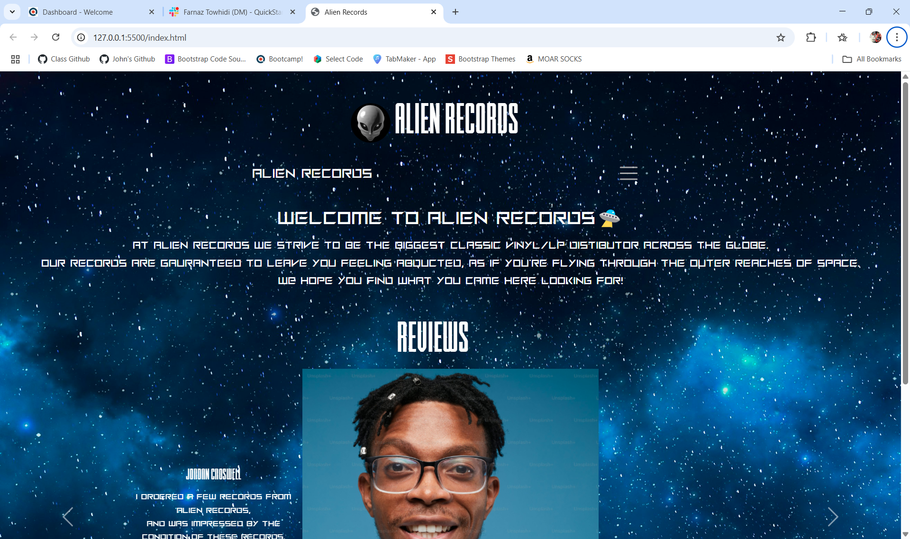
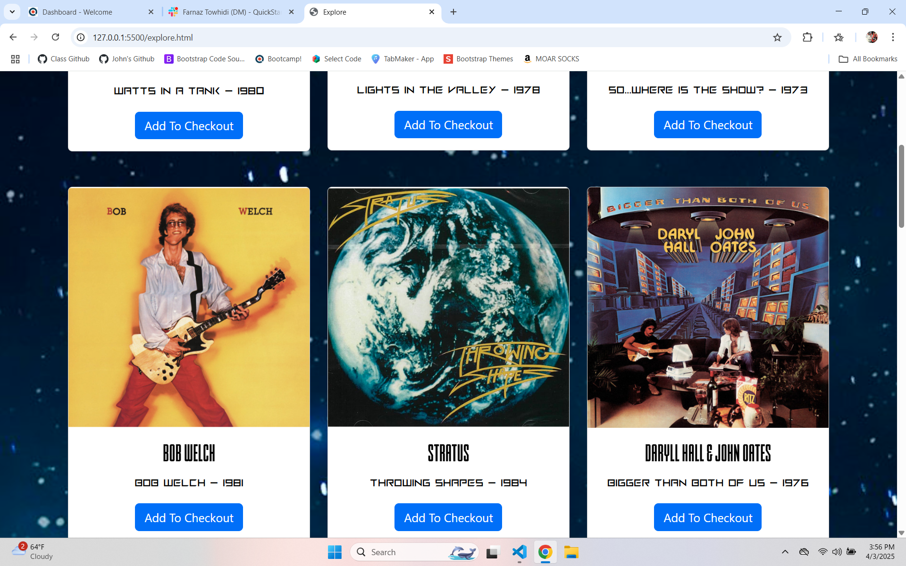
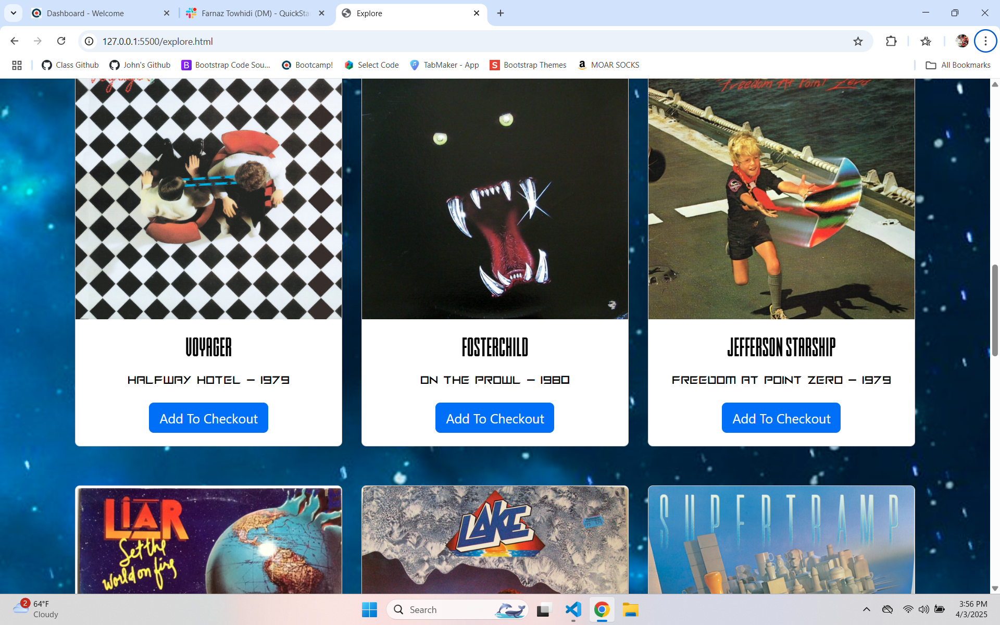
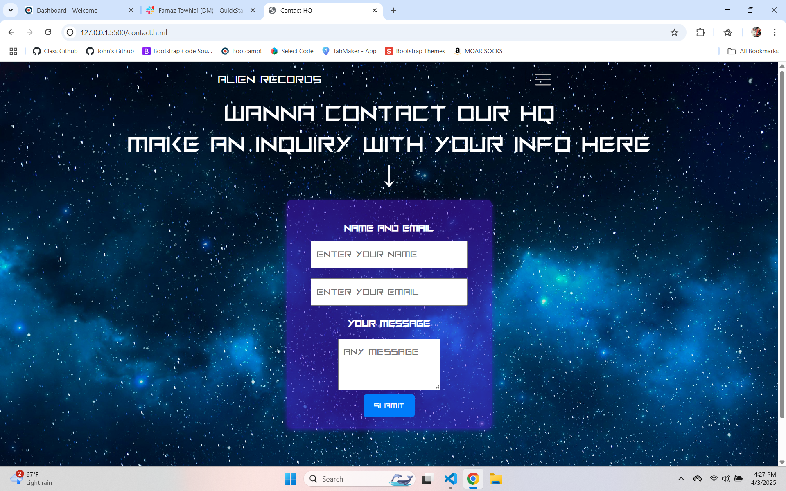

# Alien Records

### Alien Records, is an online record sales company that strives to promise nothing but delivering the biggest and best collection of "Golden Oldies". Our target demographic is anyone and everyone!

# Screenshots of Website

# User Strories

1. As a user I want to be abe to find a record, and purchase a record through the explore tab.
2. As a User I want to be able to search for records with a functional searchbar.
3. As a user I want to be able to ask any questions or make complaints in the contact page.

# Features

1. Has a contact page, which contains forms to submit any customer questions or complaints.
2. The website should be able to navigate through each tab utilizing a navbar.
3. Includes a bootstrap carousel to slide through a few reviews.
4. An explore tab that contains a series of cards inside rows and columns; These cards contain the Vinyl/LP listings which include an image, band name, album name, and the year of release.

# Technologies Used

**HTML**  
**CSS**  
**Bootsrap**  
**VS Code**

# Improvements

- functional searchbar for finding specific records
- Add links to the bands _"Discogs"_ page on the cards to learn more about the band
- Implement a working shopping cart, along with a checkout page for purchasing records
- Become a user to earn points towards discounts or special Alien Records merchandise

# Author

### _John Dell'Agnese_
